# HSD-Party
[](https://godotengine.org)

HSD-Party ist eine digitale 3D-Brettspiel- und Minispielsammlung, entwickelt mit der Godot Engine 4.

---

## Board Gameplay Logic (HSD-Campus)

Das Hauptbrettspiel (**HSD-Campus**) folgt einem rundenbasierten Brettspielprinzip für bis zu 4 Spieler. Das Ziel der Spieler ist es, über mehrere Runden hinweg durch Würfelwürfe, strategischen Item-Einsatz und Feldinteraktionen die meisten **Sterne (Bücher)** sowie Münzen zu sammeln.

---

### 1. Board Architecture & Core Systems

Das Spielbrett wird zentral über mehrere dedizierte Manager gesteuert:

* **`BiggameHSDCampus_GameManager`**:
  * Fungiert als zentraler Koordinator des Spielbretts.
  * Verwaltet die Spieler-Instanzen (`players`), den Kamerazugriff, die UI-Steuerung und Schnittstellen zu allen Sub-Managern.
  * Empfängt und verarbeitet globale Signale für Münztransaktionen, Stern-Käufe, Item-Effekte und Rundenwechsel.
* **`BiggameHSDCampus_BoardLogic`**:
  * Sucht beim Spielstart automatisch alle Knoten der Gruppe `"Tile"` und speichert sie in einem zusammenhängenden Array.
  * Verknüpft die Felder bidirektional als doppelt verkettete Liste (`current.last_tile = prev` und `current.next_tile = next`), sodass Spieler nahtlos über das Feld vor- und zurückbewegt werden können.
* **`BiggameHSDCampus_PathManager`**:
  * Verwaltet alternative Pfade und Verzweigungen auf dem Campus.
  * Verknüpft registrierte Pfadabschnitte mit entsprechenden Vorgänger- und Nachfolgerfeldern.
* **`BiggameHSDCampus_TurnManager`**:
  * Steuert die Zugreihenfolge (Spieler 0 bis Spieler N-1).
  * Verwaltet Kamera- und UI-Überblendungen beim Spielerwechsel.
  * Erhöht nach Abschluss des letzten Spielerzuges den Rundenzähler (`round_counter`) und leitet das Zwischenrunden-Minispiel bzw. das Spielende ein.
* **`BiggameHSDCampus_MoveManager`**:
  * Jedem Spieler als Subknoten zugeordnet.
  * Baut Bewegungspfade auf (`moving_tiles`), verwaltet frühzeitige Haltepunkte (`is_stopping`) und speichert verbleibende Schritte (`rest_move`).
  * Führt schrittweise Bewegungstraversierungen und Rückwärtsbewegungen aus.
* **`BiggameHSDCampus_StarManager`**:
  * Platziert dynamisch den Stern auf einem zufälligen, zugelassenen Feld.
  * Inszeniert nach jedem Sternkauf eine Kamera-Sequenz zur neuen Sternposition.
* **`BiggameHSDCampus_InventoryManager`**:
  * Verwaltet bis zu 4 Items im Inventar des jeweiligen Spielers.
  * Behandelt das Durchblättern, Aktivieren und Abbrechen von Items.
* **`BiggameHSDCampus_QuestionManager`**:
  * Verwaltet einen Fragenkatalog aus Informatik-, Programmier- und Godot-Themen für Quiz-Felder und stellt sicher, dass sich die zuletzt gestellte Frage nicht unmittelbar wiederholt.

---

### 2. Turn Cycle & Player States

Jeder Spieler durchläuft eine strikte Zustandsmaschine (`BiggameHSDCampus_Player.States`):

| State | Beschreibung |
| :--- | :--- |
| **`IDLE`** | Der Spieler ist am Zug und wartet auf Eingaben (Würfeln mit Button 1, Item-Menü mit Button 2 oder Free Cam mit Button 3). |
| **`MOVING`** | Der Spieler befindet sich in der Bewegung oder Sprunganimation über die Felder. |
| **`CHOOSING_ITEM`** | Der Spieler navigiert durch sein Inventar, um ein Item auszuwählen. |
| **`USING_ITEM`** | Das gewählte Item wird ausgeführt (z. B. Zielauswahl für Diebstahl oder Teleport). |
| **`FREE_CAM`** | Die Spielfigur pausiert, während der Spieler die Kamera frei über das Spielfeld steuert. |
| **`ON_SPLIT_TILE`** | Der Spieler steht an einer Weggabelung und wählt eine Richtung. |
| **`IN_MINIGAME`** | Board-Zustand während der Minispielphase pausiert. |

#### Ablauf eines Spielzuges:
1. **Rundenbeginn**: Der `TurnManager` aktiviert den aktuellen Spieler, richtet die Kamera aus und blendet Steuerungshinweise ein.
2. **Aktionsphase**:
   * Der Spieler kann mit **Button 2** sein Inventar öffnen, durchblättern und mit **Button 1** ein Item aktivieren (oder mit Button 3 abbrechen).
   * Der Spieler kann mit **Button 3** jederzeit die freie Kamera aktivieren, um das Spielfeld zu inspizieren.
   * Mit **Button 1** löst der Spieler den Würfelwurf aus.
3. **Würfelmechanik (`BiggameHSDCampus_Dice`)**:
   * Der Spieler führt einen Sprung in Richtung des über ihm schwebenden 3D-Würfels aus.
   * Der Würfel rotiert physikalisch/animiert und generiert eine Zufallszahl (Standard: 1 bis 10). Bei Ergebnissen > 6 werden dynamisch spezielle Texturen auf den Mesh-Oberflächen gerendert.
   * Der Würfelwert wird im UI angezeigt und bei jedem Schritt dekrementiert.
4. **Feldbewegung & Trajektorie**:
   * Die Spielfigur dreht sich in Laufrichtung und bewegt sich via Tweening Feld für Feld vorwärts.
   * Bei jedem Feld wird ein Passiersound abgespielt und die Restschrittanzeige aktualisiert.
   * Trifft der Spieler unterwegs auf ein **Stopp-Feld** (Gabelung, Stern oder Teleporter), bricht die Pfadgenerierung sofort ab, und der Restwert wird zwischengespeichert.
5. **Feld-Aktion (`do_tile_action`)**:
   * Erreicht der Spieler sein Zielfeld (oder ein Stopp-Feld), wird die feldspezifische Logik ausgeführt.
   * Bei Gabelungen (`SplitTile`) oder Teleportern (`Teleport_Tile`) wird nach der Richtungsentscheidung bzw. dem Portalübergang die Restbewegung fortgesetzt, sofern noch Schritte übrig sind.
6. **Zugende**: Sobald alle Aktionen und Restbewegungen abgeschlossen sind, ruft die Spielfigur `disable_turn()` auf, und der nächste Spieler wird aktiviert.
7. **Rundenabschluss & Siegbedingung**:
   * Haben alle Spieler ihren Zug beendet, wird die Minispiel-Zwischenrunde gestartet (Münzbelohnungen: 1. Platz = 10, 2. Platz = 5, 3. Platz = 3, 4. Platz = 1 Münze).
   * Sobald `current_round >= max_rounds` erreicht ist, endet das Spiel.
   * Die Endplatzierung erfolgt primär nach gesammelten **Sternen** und sekundär nach **Münzen** als Tie-Breaker.

---

### 3. Tile System Architecture

Alle Felder des Campus basieren auf der Basisklasse `BiggameHSDCampus_Tile` (`Node3D`). Sie definieren Eigenschaften zur Vernetzung, Kameraausrichtung, Tonwiedergabe und Aktionsausführung.

#### Stopp-Mechanik (`is_stopping`):
Ein Feld gilt als Stopp-Feld, wenn:
```gdscript
func is_stopping() -> bool:
    return is_split or is_star or is_teleport
```
Wenn der `MoveManager` einen Pfad für N Würfelaugen berechnet, bricht die Schleife beim ersten Stopp-Feld ab. Die restlichen Schritte werden in `rest_move` festgehalten, damit die Bewegung nach der Interaktion (z. B. Weggabelung) wieder aufgenommen werden kann.

#### Kamera-Winkel pro Feld (`try_switch_cam`):
Jedes Feld kann über die Export-Variablen `new_cam_x` und `new_cam_z` eine modifizierte Kameraperspektive vorgeben. Beim Betreten des Feldes wechselt die Kamera sanft ihren Betrachtungswinkel, um Kurven und Gebäude optimal einzufangen.

---

### 4. Diagram: Tile System & Resolution Flow

Das folgende Mermaid-Diagramm visualisiert die Vererbungshierarchie der Felder sowie den logischen Ablauf bei Bewegung, Stopp-Prüfung und Feldinteraktion:

```mermaid
flowchart TD
    subgraph Hierarchy["Tile Class Hierarchy"]
        BaseTile["BiggameHSDCampus_Tile (Base Class)"]
        BaseTile --> StandardTile["Standard Tile (+5 Coins)"]
        BaseTile --> NegativeTile["Negative_Tile (Coin Drain / Send-Back)"]
        BaseTile --> EventTile["Event_Tile (Random Positive/Negative Event)"]
        BaseTile --> QuizTile["Quiz_Tile (Programming Trivia Challenge)"]
        BaseTile --> ShopTile["Shop_Tile (Merchant NPC & Fixed Stock)"]
        ShopTile --> SpecialShopTile["Special_Shop_Tile (Randomized Item Stock)"]
        BaseTile --> SplitTile["SplitTile (Fork & Path Selection)"]
        BaseTile --> TeleportTile["Teleport_Tile (Warp Pipe to Paired Tile)"]
        BaseTile -.->|"Dynamic Overlay (is_star = true)"| StarHost["Star Tile (Cost: 40 Coins -> +1 Star)"]
    end

    subgraph MovementPipeline["Tile Step & Resolution Pipeline"]
        StepNext["Move to next tile in moving_tiles"] --> CheckStopping{"Is stopping tile? (Split, Teleport, or Star)"}

        CheckStopping -->|"False (Pass-through)"| Decrement["Play pass sound & decrement roll UI"]
        Decrement --> StepsRemain{"Remaining steps > 0?"}
        StepsRemain -->|"Yes"| StepNext
        StepsRemain -->|"No (Destination)"| TriggerAction["current_tile.do_tile_action(player)"]

        CheckStopping -->|"True (Early Halt)"| SaveRest["Halt step progression & save remaining moves in rest_move"]
        SaveRest --> TriggerAction

        TriggerAction --> ResolveAction{"Execute Tile Action"}

        ResolveAction -->|"Standard Tile"| ActStd["Award +5 Coins"]
        ResolveAction -->|"Negative Tile"| ActNeg["Deduct 5-15 Coins OR Move Back 3-6 Tiles"]
        ResolveAction -->|"Event Tile"| ActEv["Roll Event: Coins +/- or Spaces +/-"]
        ResolveAction -->|"Quiz Tile"| ActQuiz["Camera zoom: 4 Answers (+10 / -5 Coins)"]
        ResolveAction -->|"Shop Tile"| ActShop["Camera zoom: Cycle & Buy Items"]
        ResolveAction -->|"Split Tile"| ActSplit["Show 3D Arrow: Analog Stick Path Choice"]
        ResolveAction -->|"Teleport Tile"| ActTele["Tween Down, Warp, Tween Up at Destination"]
        ResolveAction -->|"Star Tile"| ActStar["Check Coins >= 40: Buy Star & Relocate"]

        ActStd --> HasRest{"rest_move > 0?"}
        ActNeg --> HasRest
        ActEv --> HasRest
        ActQuiz --> HasRest
        ActShop --> HasRest
        ActStar --> HasRest
        ActSplit --> HasRest
        ActTele --> HasRest

        HasRest -->|"Yes (Split / Teleport)"| ResumeWalk["Resume move_to_tiles(rest_move)"]
        ResumeWalk --> StepNext
        HasRest -->|"No"| FinishTurn["disable_turn() -> Signal on_turn_ended"]
    end
```



---

### 5. Feldtypen im Detail

#### 1. Standard-Feld (`BiggameHSDCampus_Tile`)
* **Verhalten**: Landet ein Spieler auf diesem Feld und liegt kein Stern auf, erhält er **+5 Münzen**. Nach einer kurzen Pause (1.25s) endet der Zug.
* **Passieren**: Spielt den regulären Schritt-Sound ab.

#### 2. Negativ-Feld (`Negative_Tile`)
Besitzt zwei über `is_coin_remove` konfigurierbare Modi:
* **Münzabzug (`is_coin_remove = true`)**: Zieht dem Spieler zwischen **5 und 15 Münzen** ab.
* **Rückwurf (`is_coin_remove = false`)**: Wirft den Spieler um **3 bis 6 Felder zurück** (`move_player_back`). Die Figur läuft die verkettete Liste rückwärts über `last_tile` ab.

#### 3. Event-Feld (`Event_Tile`)
Wählt bei Aktivierung zufällig eines von vier Ereignissen aus:
* `COINSPLUS`: Schenkt dem Spieler **5 bis 20 Münzen**.
* `COINSMINUS`: Zieht dem Spieler **5 bis 20 Münzen** ab.
* `FIELDPLUS`: Lässt die Figur **1 bis 5 zusätzliche Felder vorwärts** laufen.
* `FIELDMINUS`: Wirft die Figur **1 bis 5 Felder rückwärts**.
* Nach der Ausführung wird für den nächsten Besucher ein neues Event ausgewürfelt.

#### 4. Quiz-Feld (`Quiz_Tile`)
* Blendet andere Spieler aus, positioniert den aktiven Spieler vor der Quiz-Kamera und startet eine Kamera-Animation.
* Lädt über den `QuestionManager` eine zufällige Multiple-Choice-Frage mit 4 Antwortmöglichkeiten aus der Informatik und Spieleentwicklung.
* Der Spieler wählt mit den Controller-Tasten 1 bis 4 seine Antwort:
  * **Richtig**: +10 Münzen, Freuden-Animation (`"happy"`).
  * **Falsch**: -5 Münzen, Trauer-Animation (`"sad"`).
* Nach Beantwortung schwenkt die Kamera zurück und stellt die Sichtbarkeit aller Spieler wieder her.

#### 5. Shop-Feld (`Shop_Tile`)
* Überprüft, ob das Inventar des Spielers voll ist (maximal 4 Items). Wenn voll, wird der Shop sofort übersprungen.
* Richtet die Kamera auf das Händler-Modell (`koch.tscn`) und öffnet das Shop-UI.
* **Steuerung im Shop**:
  * **Button 2**: Nächstes Item markieren.
  * **Button 1**: Ausgewähltes Item kaufen (sofern genügend Münzen vorhanden sind).
  * **Button 3**: Shop ohne Kauf verlassen.
* Nach dem Kauf wird der Preis abgezogen, das Item im `InventoryManager` registriert und die Verlassen-Animation abgespielt.

#### 6. Spezial- / Zufalls-Shop (`Special_Shop_Tile`)
* Erweitert das reguläre Shop-Feld.
* Generiert bei jedem Betreten ein dynamisches Sortiment aus bis zu 4 zufällig gewählten Items aus einem übergeordneten Item-Pool (`available_item_pool`).

#### 7. Weggabelung / Split-Feld (`SplitTile`)
* Gilt als Stopp-Feld (`is_stopping = true`). Der Spieler hält sofort an, auch wenn noch Schritte übrig sind.
* Instanziiert einen visuellen 3D-Pfeilindikator (`dot.png`) zwischen dem aktuellen Feld und den wählbaren Nachfolgefeldern (`path_options`).
* Der Spieler wählt über die horizontale Achse (Analogstick/Steuerkreuz) den gewünschten Pfad aus und bestätigt mit **Button 1**.
* Wurde der Pfad gewählt, setzt der Spieler seine Restbewegung (`rest_move`) entlang der neuen Strecke fort.

#### 8. Teleporter-Feld (`Teleport_Tile`)
* Gilt als Stopp-Feld (`is_stopping = true`).
* Fest mit einem Ziel-Teleporter (`teleport_destination`) verknüpft.
* Bewegt die Spielfigur via Tweening nach unten in das Einstiegsrohr (`teleport_down.wav`).
* Führt eine Bildüberblendung durch, versetzt die Spielfigur an die Zielkoordinaten, passt den Kamerawinkel an und fährt die Figur wieder aus dem Zielrohr nach oben (`teleport_up.wav`).
* Falls nach dem Betreten noch Schritte im Würfelwurf übrig waren, läuft die Figur vom Zielfeld aus weiter.

---

### 6. The Star System (`StarManager`)

Das Sternsystem ist das primäre Ziel des Brettspiels:
* **Sternmodell**: Wird im Spiel durch ein schwebendes, langsam rotierendes 3D-Buch (`BookR.glb`) symbolisiert.
* **Positionierung**: Der `StarManager` wählt beim Spielstart und nach jedem Kauf ein zufälliges Feld auf dem Brett aus. Ausgeschlossen sind Split-Felder, Teleport-Felder und das Feld des vorherigen Sterns.
* **Kosten & Kauf**:
  * Der Kaufpreis beträgt **40 Münzen**.
  * Jedes Feld mit aktivem Stern fungiert automatisch als Stopp-Feld (`is_stopping = true`).
  * Hat der Spieler beim Erreichen mindestens 40 Münzen, werden die Münzen abgezogen, der Stern gutgeschrieben (`stars += 1`), und der Stern auf dem aktuellen Feld deaktiviert.
  * Hat der Spieler nicht genügend Münzen, endet der Zug ohne Kauf.
* **Kamera-Präsentation**: Nach jedem Sternkauf schwenkt die Hauptkamera für 4 Sekunden mit sanfter Überblendung zur neuen Sternposition auf dem Campus, bevor das Spiel fortgesetzt wird.

---

### 7. Items & Inventory

Spieler können Items in Shops erwerben und vor ihrem Würfelwurf taktisch einsetzen:

* **Inventargröße**: Maximal 4 Items pro Spieler.
* **Inventar-Steuerung**:
  * **Button 2 (im Idle)**: Inventar öffnen und durch Items rotieren.
  * **Button 1**: Ausgewähltes Item bestätigen und aktivieren.
  * **Button 3**: Item-Auswahl abbrechen und in den Idle-Zustand zurückkehren.

#### Verfügbare Items (`BiggameHSDCampus_Item`):
1. **Großer Würfel (`BIG_DICE`)**:
   * Ändert den Würfelmodus auf `Dice_Type.BIG`.
   * Der nächste Würfelwurf liefert garantiert einen hohen Wert zwischen **8 und 10**.
2. **Kleiner Würfel (`SMALL_DICE`)**:
   * Ändert den Würfelmodus auf `Dice_Type.SMALL`.
   * Der nächste Würfelwurf liefert einen präzisen niedrigen Wert zwischen **1 und 4**.
3. **Münzdieb (`STEAL_COINS`)**:
   * Öffnet ein Auswahlmenü für gegnerische Spieler (Tasten 1–4).
   * Stiehlt dem ausgewählten Zielspieler eine festgelegte Menge an Münzen und überträgt sie dem Anwender.
4. **Item-Dieb (`STEAL_ITEM`)**:
   * Öffnet die Zielspielerauswahl.
   * Stiehlt dem Zielspieler zufällig ein Item aus dessen Inventar und fügt es dem eigenen Inventar hinzu.
5. **Spieler-Teleporter (`TELEPORT_TO_OTHER`)**:
   * Teleportiert den Anwender direkt auf das Feld eines ausgewählten Mitspielers.
   * Löst sofort die Aktion des Zielfeldes für den Anwender aus.
6. **Stern-Teleporter (`TELEPORT_TO_STAR`)**:
   * Teleportiert den Anwender augenblicklich direkt auf das aktuelle Stern-Feld.
   * Triggert unmittelbar die Kaufabfrage für den Stern.
7. **Duell-Item (`DUELL_ITEM`)**:
   * Fordert einen gewählten Mitspieler zu einem Duell um Münzen heraus.

---

### 8. Camera System & Free Cam Mode

Die Spielfeldkamera (`BiggameHSDCampus_CameraLogic`) bietet dynamische Verfolgung und freie Erkundung:

* **Folgemodus**: Verfolgt den aktiven Spieler mittels linearer Interpolation (`lerp`) und hält ihn über `look_at()` kontinuierlich im Fokus.
* **Feldabhängige Winkel**: Passt über Signale der Einzelfelder automatisch X- und Z-Offsets an, um Kurven optimal einzufangen.
* **Fokus & Zoom**: Zoomt bei Interaktionen (Shop, Quiz, Split-Felder) heran.
* **Freie Kamera (`change_free_cam`)**:
  * Kann vom aktiven Spieler während des Zustands `IDLE` oder `ON_SPLIT_TILE` mit **Button 3** ein- und ausgeschaltet werden.
  * **Bewegung**: Schwenken über das Spielfeld entlang der X- und Z-Achsen mittels Analogstick oder Richtungstasten.
  * **Zoom**: Hineinzoomen mit **Button 1**, Herauszoomen mit **Button 2**.
  * Die Kamerabewegung ist durch Campus-Grenzen (`MAX_X`, `MAX_Z`, `MAX_ZOOM`, `MAX_OUT`) begrenzt.
  * Ein erneuter Druck auf **Button 3** setzt die Kamera wieder zentriert auf den Spieler zurück.

---
