```mermaid
flowchart TD
    subgraph Hierarchy["Tile Class Hierarchy"]
        BaseTile["BiggameHSDCampus_Tile (Base Class)"]
        BaseTile --> StandardTile["Standard Tile (+5 Coins)"]
        BaseTile --> NegativeTile["Negative_Tile (Coin Drain / Send-Back)"]
        BaseTile --> EventTile["Event_Tile (Random Positive/Negative Event)"]
        BaseTile --> QuizTile["Quiz_Tile (Programming Trivia Challenge)"]
        BaseTile --> ShopTile["Shop_Tile (Merchant NPC & Fixed Stock)"]
        ShopTile --> SpecialShopTile["Special_Shop_Tile (Randomized Item Stock)"]
        BaseTile --> SplitTile["SplitTile (Fork & Path Selection)"]
        BaseTile --> TeleportTile["Teleport_Tile (Warp Pipe to Paired Tile)"]
        BaseTile -.->|"Dynamic Overlay (is_star = true)"| StarHost["Star Tile (Cost: 40 Coins -> +1 Star)"]
    end

    subgraph MovementPipeline["Tile Step & Resolution Pipeline"]
        StepNext["Move to next tile in moving_tiles"] --> CheckStopping{"Is stopping tile? (Split, Teleport, or Star)"}

        CheckStopping -->|"False (Pass-through)"| Decrement["Play pass sound & decrement roll UI"]
        Decrement --> StepsRemain{"Remaining steps > 0?"}
        StepsRemain -->|"Yes"| StepNext
        StepsRemain -->|"No (Destination)"| TriggerAction["current_tile.do_tile_action(player)"]

        CheckStopping -->|"True (Early Halt)"| SaveRest["Halt step progression & save remaining moves in rest_move"]
        SaveRest --> TriggerAction

        TriggerAction --> ResolveAction{"Execute Tile Action"}

        ResolveAction -->|"Standard Tile"| ActStd["Award +5 Coins"]
        ResolveAction -->|"Negative Tile"| ActNeg["Deduct 5-15 Coins OR Move Back 3-6 Tiles"]
        ResolveAction -->|"Event Tile"| ActEv["Roll Event: Coins +/- or Spaces +/-"]
        ResolveAction -->|"Quiz Tile"| ActQuiz["Camera zoom: 4 Answers (+10 / -5 Coins)"]
        ResolveAction -->|"Shop Tile"| ActShop["Camera zoom: Cycle & Buy Items"]
        ResolveAction -->|"Split Tile"| ActSplit["Show 3D Arrow: Analog Stick Path Choice"]
        ResolveAction -->|"Teleport Tile"| ActTele["Tween Down, Warp, Tween Up at Destination"]
        ResolveAction -->|"Star Tile"| ActStar["Check Coins >= 40: Buy Star & Relocate"]

        ActStd --> HasRest{"rest_move > 0?"}
        ActNeg --> HasRest
        ActEv --> HasRest
        ActQuiz --> HasRest
        ActShop --> HasRest
        ActStar --> HasRest
        ActSplit --> HasRest
        ActTele --> HasRest

        HasRest -->|"Yes (Split / Teleport)"| ResumeWalk["Resume move_to_tiles(rest_move)"]
        ResumeWalk --> StepNext
        HasRest -->|"No"| FinishTurn["disable_turn() -> Signal on_turn_ended"]
    end
```

# HSD-Party
[](https://godotengine.org)

HSD-Party is a digital 3D board game and minigame collection developed with Godot Engine 4.

---

## Board Gameplay Logic (HSD-Campus)

The main board game (**HSD-Campus**) follows a turn-based board game mechanic for up to 4 players. The players' objective is to collect the most **stars (books)** and coins across multiple rounds through dice rolls, strategic item usage, and tile interactions.

---

### 1. Board Architecture & Core Systems

The game board is controlled centrally by several dedicated managers:

* **`BiggameHSDCampus_GameManager`**:
  * Acts as the central coordinator of the game board.
  * Manages player instances (`players`), camera access, UI controls, and interfaces to all sub-managers.
  * Receives and processes global signals for coin transactions, star purchases, item effects, and round changes.
* **`BiggameHSDCampus_BoardLogic`**:
  * Automatically finds all nodes in the `"Tile"` group at game start and stores them in a contiguous array.
  * Links tiles bidirectionally as a double linked list (`current.last_tile = prev` and `current.next_tile = next`), allowing players to move seamlessly forward and backward across the board.
* **`BiggameHSDCampus_PathManager`**:
  * Manages alternative paths and branches across the campus.
  * Links registered path segments with their respective predecessor and successor tiles.
* **`BiggameHSDCampus_TurnManager`**:
  * Controls turn order (Player 0 to Player N-1).
  * Manages camera and UI transitions when switching players.
  * Increments the round counter (`round_counter`) after the last player's turn finishes and initiates the mid-round minigame or the end of the game.
* **`BiggameHSDCampus_MoveManager`**:
  * Assigned to each player as a subnode.
  * Builds movement paths (`moving_tiles`), handles early stopping points (`is_stopping`), and stores remaining steps (`rest_move`).
  * Executes step-by-step movement traversals and backward movements.
* **`BiggameHSDCampus_StarManager`**:
  * Dynamically places the star on a random, eligible tile.
  * Orchestrates a camera sequence to the new star location after each star purchase.
* **`BiggameHSDCampus_InventoryManager`**:
  * Manages up to 4 items in each player's inventory.
  * Handles browsing, activating, and canceling items.
* **`BiggameHSDCampus_QuestionManager`**:
  * Manages a catalog of questions covering computer science, programming, and Godot topics for quiz tiles, ensuring that the most recently asked question is not immediately repeated.

---

### 2. Turn Cycle & Player States

Each player goes through a strict state machine (`BiggameHSDCampus_Player.States`):

| State | Description |
| :--- | :--- |
| **`IDLE`** | It is the player's turn, waiting for input (dice roll with Button 1, item menu with Button 2, or Free Cam with Button 3). |
| **`MOVING`** | The player is moving or performing the jump animation across the tiles. |
| **`CHOOSING_ITEM`** | The player is navigating through their inventory to select an item. |
| **`USING_ITEM`** | The chosen item is being executed (e.g., target selection for theft or teleportation). |
| **`FREE_CAM`** | The player character pauses while the player freely controls the camera across the board. |
| **`ON_SPLIT_TILE`** | The player is standing at a path fork and choosing a direction. |
| **`IN_MINIGAME`** | Board state paused during the minigame phase. |

#### Turn Progression:
1. **Turn Start**: The `TurnManager` activates the current player, aligns the camera, and displays control hints.
2. **Action Phase**:
   * The player can open their inventory with **Button 2**, browse through items, and activate an item with **Button 1** (or cancel with Button 3).
   * The player can activate the free camera with **Button 3** at any time to inspect the board.
   * The player triggers the dice roll with **Button 1**.
3. **Dice Mechanic (`BiggameHSDCampus_Dice`)**:
   * The player performs a jump towards the 3D die floating above them.
   * The die rotates physically/animated and generates a random number (default: 1 to 10). For results > 6, special textures are dynamically rendered on the mesh surfaces.
   * The rolled value is displayed in the UI and decremented with each step.
4. **Tile Movement & Trajectory**:
   * The player character turns towards the direction of movement and moves forward tile by tile via tweening.
   * At each tile, a pass-through sound plays, and the remaining step counter is updated.
   * If the player encounters a **stopping tile** along the way (fork, star, or teleporter), path generation halts immediately, and the remaining steps are cached.
5. **Tile Action (`do_tile_action`)**:
   * When the player reaches their target tile (or a stopping tile), the tile-specific logic is executed.
   * At forks (`SplitTile`) or teleporters (`Teleport_Tile`), after the directional choice or portal transition, remaining movement continues if steps are still left.
6. **Turn End**: Once all actions and remaining movements are completed, the player character calls `disable_turn()`, and the next player is activated.
7. **Round Completion & Win Condition**:
   * Once all players have completed their turns, the minigame intermission begins (coin rewards: 1st place = 10, 2nd place = 5, 3rd place = 3, 4th place = 1 coin).
   * As soon as `current_round >= max_rounds` is reached, the game ends.
   * The final ranking is determined primarily by collected **stars** and secondarily by **coins** as a tie-breaker.

---

### 3. Tile System Architecture

All tiles on the campus are based on the base class `BiggameHSDCampus_Tile` (`Node3D`). They define properties for networking/linking, camera alignment, sound playback, and action execution.

#### Stopping Mechanic (`is_stopping`):
A tile is considered a stopping tile if:
```gdscript
func is_stopping() -> bool:
    return is_split or is_star or is_teleport
```
When the `MoveManager` calculates a path for N rolled steps, the loop breaks at the first stopping tile. The remaining steps are stored in `rest_move` so that movement can resume after the interaction (e.g., path fork).

#### Camera Angle per Tile (`try_switch_cam`):
Each tile can define a modified camera perspective via the export variables `new_cam_x` and `new_cam_z`. Upon stepping onto the tile, the camera smoothly transitions its viewing angle to optimally capture corners and buildings.

---

### 4. Diagram: Tile System & Resolution Flow

The following Mermaid diagram visualizes the inheritance hierarchy of tiles as well as the logical flow during movement, stop checks, and tile interaction:



---

### 5. Tile Types in Detail

#### 1. Standard Tile (`BiggameHSDCampus_Tile`)
* **Behavior**: If a player lands on this tile and there is no active star on it, they receive **+5 coins**. After a brief pause (1.25s), the turn ends.
* **Pass-through**: Plays the standard walking/stepping sound.

#### 2. Negative Tile (`Negative_Tile`)
Features two modes configurable via `is_coin_remove`:
* **Coin Drain (`is_coin_remove = true`)**: Deducts between **5 and 15 coins** from the player.
* **Knockback (`is_coin_remove = false`)**: Knocks the player back by **3 to 6 tiles** (`move_player_back`). The character traverses the linked list backwards via `last_tile`.

#### 3. Event Tile (`Event_Tile`)
Randomly selects one of four events upon activation:
* `COINSPLUS`: Grants the player **5 to 20 coins**.
* `COINSMINUS`: Deducts **5 to 20 coins** from the player.
* `FIELDPLUS`: Causes the character to advance **1 to 5 additional tiles**.
* `FIELDMINUS`: Knocks the character **1 to 5 tiles backward**.
* After execution, a new event is rolled for the next visitor.

#### 4. Quiz Tile (`Quiz_Tile`)
* Hides other players, positions the active player in front of the quiz camera, and starts a camera animation.
* Loads a random multiple-choice question with 4 options covering computer science and game development via `QuestionManager`.
* The player selects their answer using controller buttons 1 through 4:
  * **Correct**: +10 coins, celebration animation (`"happy"`).
  * **Incorrect**: -5 coins, disappointment animation (`"sad"`).
* After answering, the camera pans back and restores visibility for all players.

#### 5. Shop Tile (`Shop_Tile`)
* Checks if the player's inventory is full (maximum of 4 items). If full, the shop is skipped immediately.
* Aligns the camera to the merchant model (`koch.tscn`) and opens the shop UI.
* **Shop Controls**:
  * **Button 2**: Highlight next item.
  * **Button 1**: Purchase selected item (if enough coins are available).
  * **Button 3**: Exit shop without purchasing.
* After purchase, the price is deducted, the item is registered in the `InventoryManager`, and the departure animation plays.

#### 6. Special / Random Shop (`Special_Shop_Tile`)
* Extends the regular shop tile.
* Generates a dynamic assortment of up to 4 randomly chosen items from an overarching item pool (`available_item_pool`) upon every visit.

#### 7. Fork / Split Tile (`SplitTile`)
* Considered a stopping tile (`is_stopping = true`). The player stops immediately, even if steps remain.
* Instantiates a visual 3D arrow indicator (`dot.png`) between the current tile and the selectable successor tiles (`path_options`).
* The player selects the desired path via the horizontal axis (analog stick / D-pad) and confirms with **Button 1**.
* Once the path is chosen, the player continues their remaining movement (`rest_move`) along the new route.

#### 8. Teleporter Tile (`Teleport_Tile`)
* Considered a stopping tile (`is_stopping = true`).
* Fixedly paired with a destination teleporter (`teleport_destination`).
* Moves the player character downward into the entry pipe via tweening and sound (`teleport_down.wav`).
* Performs a screen fade, relocates the character to the destination coordinates, adjusts the camera angle, and moves the character back up out of the exit pipe with corresponding sound(`teleport_up.wav`).
* If remaining steps were left from the dice roll upon entering, the character continues moving forward from the destination tile.

---

### 6. The Star System (`StarManager`)

The star system is the primary objective of the board game:
* **Star Model**: Symbolized in-game by a floating, slowly rotating 3D book (`BookR.glb`).
* **Placement**: The `StarManager` selects a random tile on the board at game start and after every purchase. Split tiles, teleport tiles, and the tile of the previous star are excluded.
* **Cost & Purchase**:
  * The purchase price is **40 coins**.
  * Any tile with an active star automatically acts as a stopping tile (`is_stopping = true`).
  * If the player has at least 40 coins upon reaching it, the coins are deducted, the star is credited (`stars += 1`), and the star on the current tile is deactivated.
  * If the player does not have enough coins, the turn ends without a purchase.
* **Camera Presentation**: After each star purchase, the main camera pans to the new star location on the campus for 4 seconds with a smooth blend before the game continues.

---

### 7. Items & Inventory

Players can purchase items in shops and use them tactically before rolling the dice:

* **Inventory Capacity**: Maximum of 4 items per player.
* **Inventory Controls**:
  * **Button 2 (in Idle)**: Open inventory and cycle through items.
  * **Button 1**: Confirm and activate the selected item.
  * **Button 3**: Cancel item selection and return to the Idle state.

#### Available Items (`BiggameHSDCampus_Item`):
1. **Big Die (`BIG_DICE`)**:
   * Changes the dice mode to `Dice_Type.BIG`.
   * The next dice roll is guaranteed to yield a high value between **8 and 10**.
2. **Small Die (`SMALL_DICE`)**:
   * Changes the dice mode to `Dice_Type.SMALL`.
   * The next dice roll yields a precise low value between **1 and 4**.
3. **Coin Thief (`STEAL_COINS`)**:
   * Opens a player selection menu for opponents (Buttons 1–4).
   * Steals a set amount of coins from the targeted player and transfers them to the user.
4. **Item Thief (`STEAL_ITEM`)**:
   * Opens opponent target selection.
   * Steals a random item from the target player's inventory and adds it to the user's inventory.
5. **Player Teleporter (`TELEPORT_TO_OTHER`)**:
   * Teleports the user directly onto the tile of a chosen fellow player.
   * Immediately triggers the target tile's action for the user.
6. **Star Teleporter (`TELEPORT_TO_STAR`)**:
   * Instantly teleports the user directly onto the current star tile.
   * Immediately triggers the purchase prompt for the star.
7. **Duel Item (`DUELL_ITEM`)**:
   * Challenges a chosen fellow player to a duel for coins.

---

### 8. Camera System & Free Cam Mode

The board camera (`BiggameHSDCampus_CameraLogic`) provides dynamic tracking and free exploration:

* **Follow Mode**: Follows the active player using linear interpolation (`lerp`) and continuously keeps them in focus via `look_at()`.
* **Tile-Dependent Angles**: Automatically adjusts X and Z offsets via signals from individual tiles to capture curves and corners optimally.
* **Focus & Zoom**: Zooms in during interactions (Shop, Quiz, Split tiles).
* **Free Camera (`change_free_cam`)**:
  * Can be toggled on and off by the active player during the `IDLE` or `ON_SPLIT_TILE` state with **Button 3**.
  * **Movement**: Pan across the board along the X and Z axes using the analog stick or directional keys.
  * **Zoom**: Zoom in with **Button 1**, zoom out with **Button 2**.
  * Camera movement is clamped by campus boundaries (`MAX_X`, `MAX_Z`, `MAX_ZOOM`, `MAX_OUT`).
  * Pressing **Button 3** again resets and centers the camera back on the player.

---
